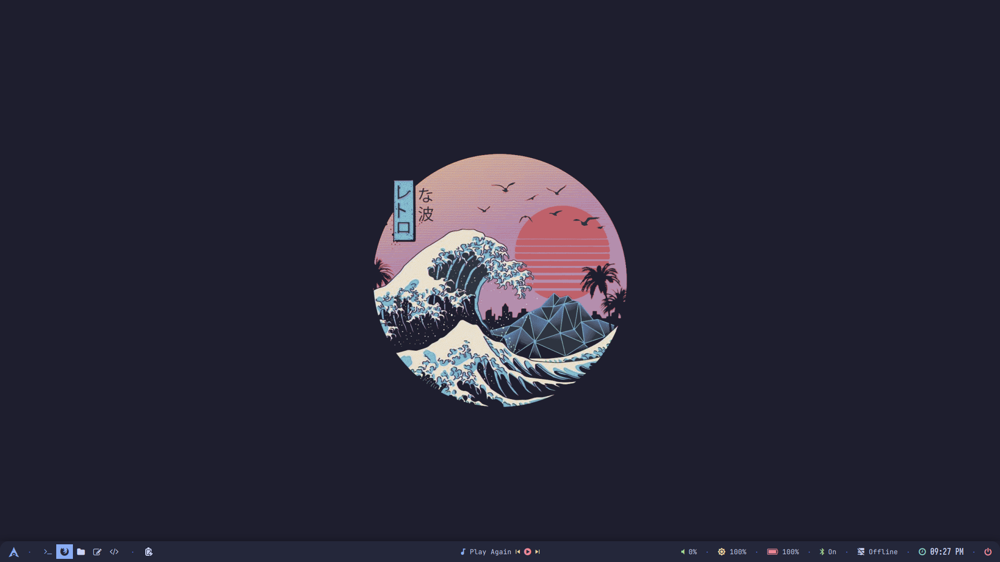

# Dotfiles

My dot files for my personal laptop. Message me if you want something added 
and/or if I'm missing anything in it.

A few screenshots will follow:




# Installing Interfaces

Copy /interfaces -> /etc/systemd/network/

Now we need some mild reconfiguration

run:
```
sudo udevadm trigger --verbose --subsystem-match=net --action=add

OUTPUT:
/sys/devices/pci0000:00/****:**:**.*/net/ghost0
/sys/devices/pci0000:00/0000:00:ff.0/****:**:**.*/net/FuckOff0
...
```

copy the field right before net (the stars) on wlan0 or other wireless interface name
go into 80-ghost0.link:
	change pci-**:**:**.* to the field you just copied
  make sure you leave "pci-"

Do the same for 80-FuckOff0.link, instead of wlan0 use eth0 or other wired interface name

# Installing initcpio message

Edit /etc/default/grub:
remove both quiet and splash wherever you see
save and exit

create /etc/initcpio/hooks && /etc/initcpio/install if not already there

copy /initcpio/hooks/ghost_systems -> /etc/initcpio/hooks/
copy /initcpio/install/ghost_systems -> /etc/initcpio/install/

edit /etc/initcpio.conf:
	find HOOKS=(...)
	
add ghost_systems directly after base and udev:

HOOKS=(base udev ghost_systems ...)

run:
```
sudo mkinitcpio -P
```

# Installing Grub Theme

Copy /grub/ghost to /boot/grub/themes

Edit /etc/default/grub:
	change "GRUB_THEME" to "/boot/grub/themes/ghost/theme.txt"

run: 
```
sudo grub-mkconfig -o /boot/grub/grub.cfg
```

# Installing Neovim Plugins

First install neovim with your package manager

Install vim-plug with:
```
sh -c 'curl -fLo "${XDG_DATA_HOME:-$HOME/.local/share}"/nvim/site/autoload/plug.vim --create-dirs \
  https://raw.githubusercontent.com/junegunn/vim-plug/master/plug.vim'
```
Copy /nvim/* -> ~/.config/nvim/

Run neovim

*Ignore error messages if you receive them, this is because init.lua is trying to install non-intalled packages*

Run command inside Neovim:  
```
:PlugInstall
```

Restart Neovim and enjoy!

*side note, if not copying .zshrc, I would recommend adding:
```
alias nv='nvim --cmd "set number"'
```

# Installing Kitty Theme

Copy /kitty/* -> ~/.config/kitty/

Add line to .zshrc (if not copying .zshrc over):
```
alias icat='kitty +kitten icat'
```

Install ttf-jetbrains-mono-nerd with your favourite package manager

# Now enjoy your new setup 👍
